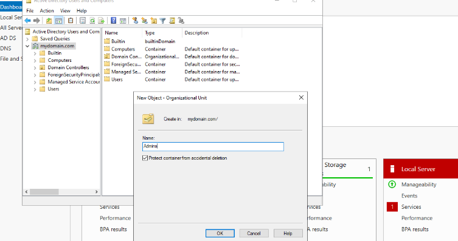
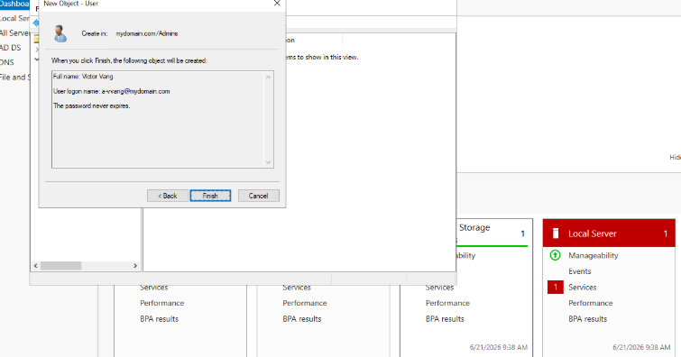
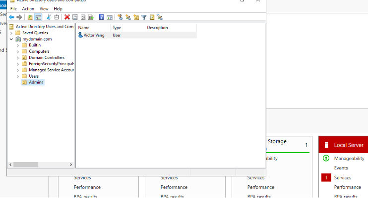
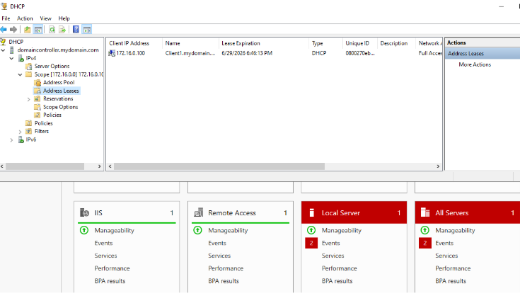
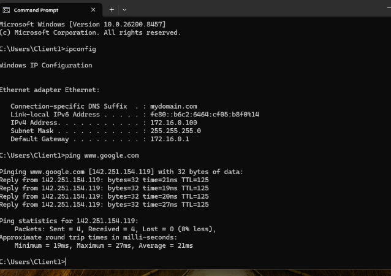
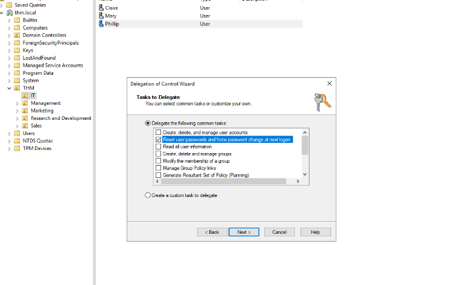
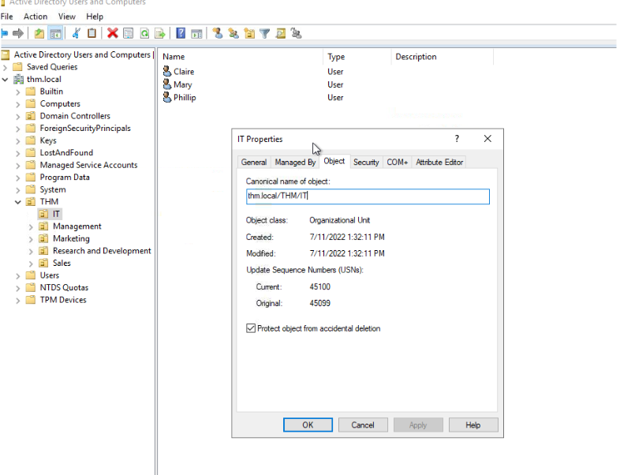
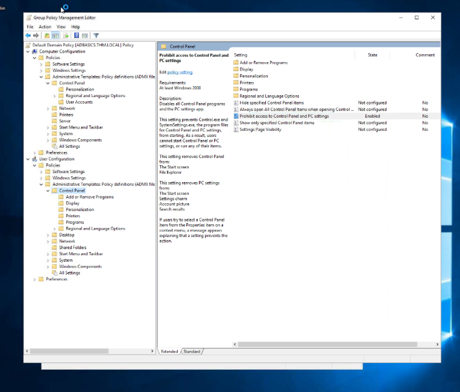
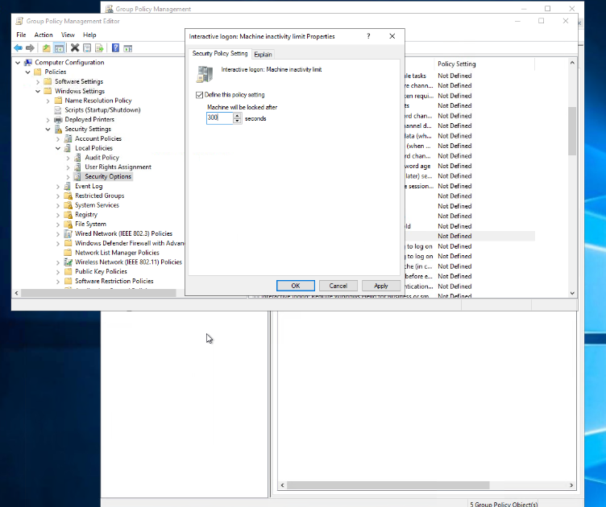
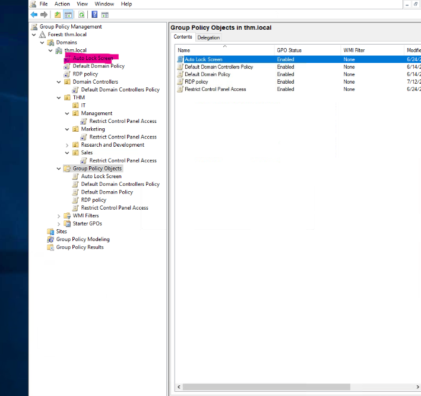

# Active Directory
## Objective
The purpose of this lab is to practice Active Directory Basics.

## Environment
- VirtualBox
- TryHackMe VMs
- Windows Server 2022, Windows 11, Ubuntu Server 22.04

## Steps

### 1. Installed Active Directory Domain Services
- Opened Server Manager on Windows Server 2022
- Added the Active Directory Domain Services role
- Promoted server to Domain Controller
- Created domain: mydomain.com
- Restarted server to complete promotion

### 2. Configured DHCP Server
- Installed DHCP Server role through Server Manager
- Created a new DHCP scope
- Defined IP address range for client machines
- Authorized the DHCP server in Active Directory

### 3. Created Organizational Unit
- Opened Active Directory Users and Computers
- Created OU named Admins
- Used to organize and separate user accounts

*Organizational Unit admins created*

### 4. Created Admin User
- Created dedicated admin account inside AD
- Assigned to Domain Admins group
- Used for day to day management instead of 
  default Administrator account

*Admin user accounts created*

### 5. Created Standard User Account
- Created a regular user account for testing
- Placed inside the OU named Users
  

*Standard user accounts created*

### 6. Verified Network Connectivity
- Logged into client Windows 11 VM with 
  standard user account
- Confirmed internet access working through 
  DHCP assigned IP address
- Verified domain join was successful

*Verify client1 is connected to domain on domain controller*

*Verify client1 is connected to the domain controller and internet*

### 7. Delegated Password Reset Permissions
- Selected a standard user to act as helpdesk staff
- Delegated permission to reset passwords and 
  force password change at next login
- Verified delegated user could reset passwords 
  without full admin access

*Giving Philip persmission to reset passwords and force password reset next login*

### 8. Configured OU Deletion Protection
- Enabled accidental deletion protection on OUs
  during creation
- Practiced disabling protection in order to 
  delete an OU
- Noted this is a best practice to prevent 
  accidental removal of critical directory objects

*Showing that IT is protected from deletion. To delete, we would have to uncheck that box*

### 9. Configured Group Policy Objects (GPOs)
- Opened Group Policy Management Console (GPMC)
- Created a new GPO and linked it to the Employees OU

**Policy 1: Restrict Access to Control Panel and PC Settings**
- Navigated to User Configuration → Policies → 
  Administrative Templates → Control Panel
- Enabled "Prohibit access to Control Panel and 
  PC Settings"
- Prevents standard users from modifying system 
  settings — common in corporate environments to 
  maintain system integrity

**Policy 2: Auto Lock Screen After Idle**
- Navigated to Computer Configuration → Policies → 
  Windows Settings → Security Settings → 
  Local Policies → Security Options
- Set interactive logon machine inactivity limit 
  to 300 seconds (5 minutes)
- Ensures unattended machines are automatically 
  locked — a basic security requirement in most 
  organizations

- Ran gpupdate /force on client VM to apply 
  policies immediately
- Verified both policies applied correctly on 
  client machine

*Prohibit access to Control Panel policy enabled*

*Machine inactivity limit set to 300 seconds*

## Issues & Troubleshooting

**No critical issues encountered during initial setup.**

However the following are common issues to be aware 
of in this environment:

- **OU deletion fails** — caused by accidental 
  deletion protection being enabled. Fix: go to 
  View → Advanced Features in AD Users and 
  Computers, then uncheck the protection box in 
  the OU properties

- **Delegation not applying correctly** — verify 
  the correct OU was selected during the Delegation 
  of Control wizard and that the user account is 
  in the right group

## What I Learned
- DHCP and Active Directory work together — the DC 
  hands out IP addresses to client machines while 
  simultaneously managing their user accounts and 
  permissions

- Organizational Units act like folders that let you 
  organize and manage users by department or role 
  rather than dumping everyone into one flat list

- Creating separate admin and standard user accounts 
  is best practice — you don't use the default 
  Administrator account for day to day tasks

- Joining a client machine to the domain and logging 
  in with a domain user account confirmed the whole 
  environment was communicating correctly

- OUs have an accidental deletion protection setting 
  that must be manually disabled before the OU can 
  be removed — an important safeguard in real 
  environments where mistakes are costly

- Delegation of Control allows specific users to 
  perform limited admin tasks like password resets 
  without being granted full Domain Admin privileges 

- Disabling a user account rather than deleting it 
  is best practice when an employee leaves — the 
  account and its history are preserved in case 
  they're needed later

  - Group Policy Objects allow admins to enforce 
  settings across all machines in an OU without 
  touching each computer individually

- Restricting Control Panel access is a common 
  corporate security practice that prevents standard 
  users from changing network settings, uninstalling 
  software, or modifying system configurations

- Auto lock policies are a basic security standard 
  — an unattended unlocked machine is a security 
  risk in any office environment

- GPO settings are split between User Configuration 
  and Computer Configuration — User Configuration 
  applies to the user regardless of which machine 
  they log into, Computer Configuration applies to 
  the machine regardless of who logs in

- Running gpupdate /force immediately applies 
  pending policies without waiting for the automatic 
  90 minute refresh cycle
