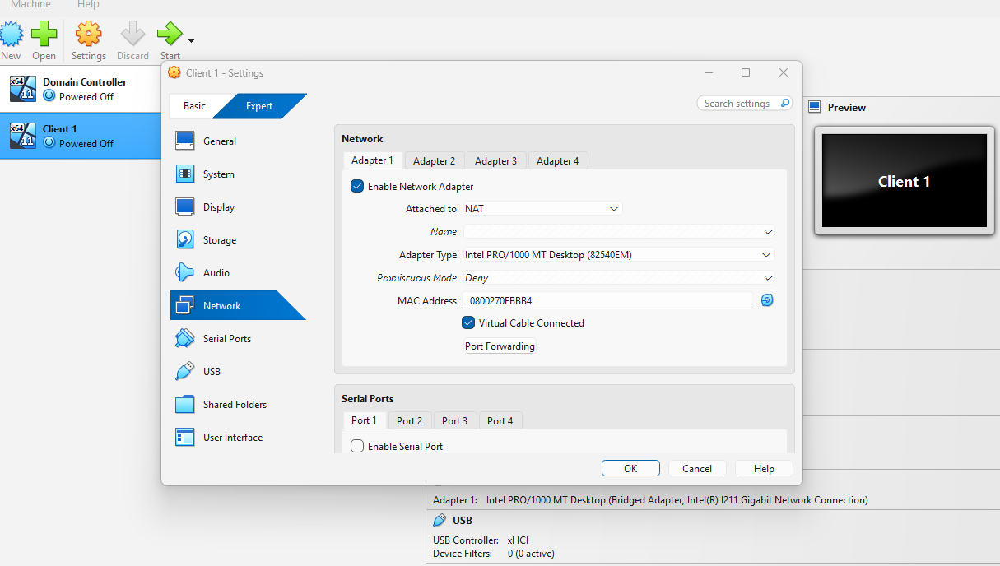
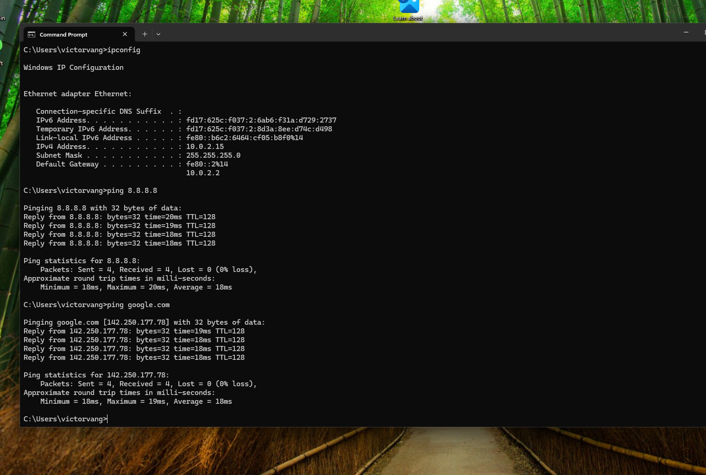
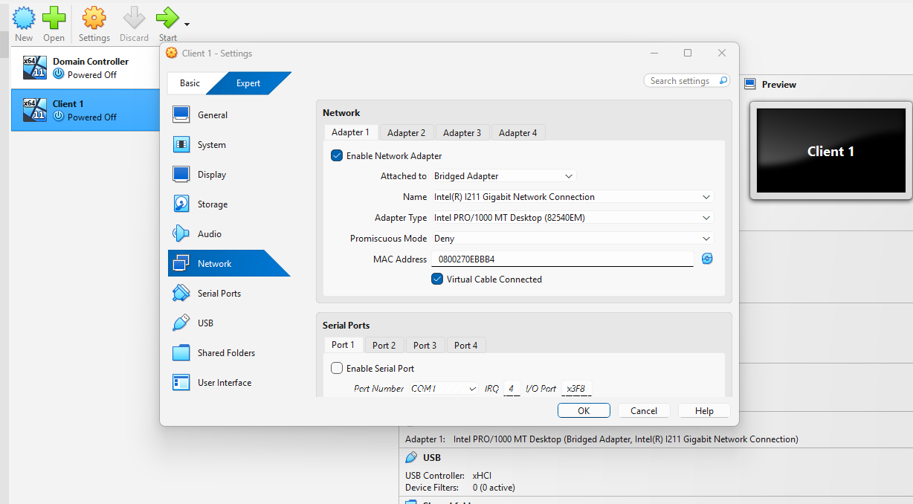
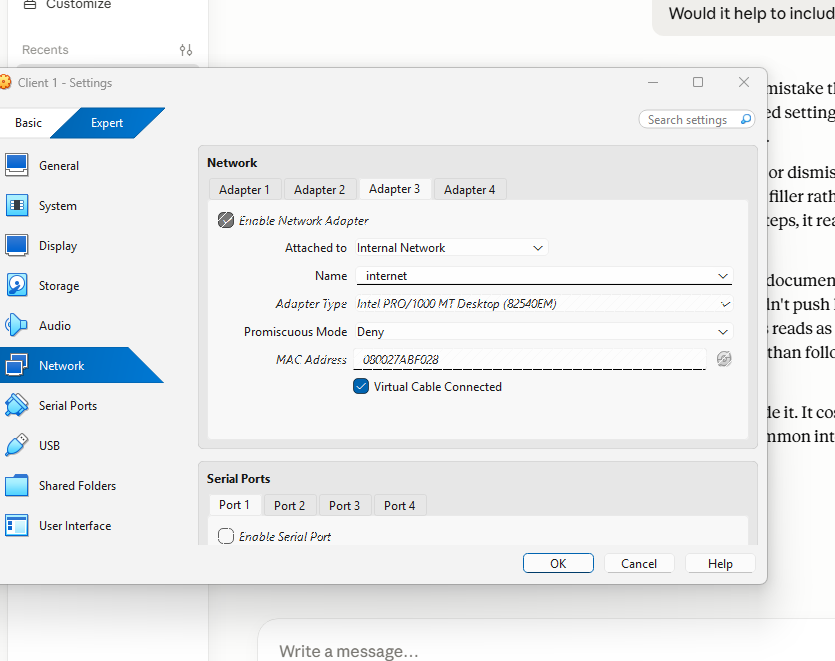
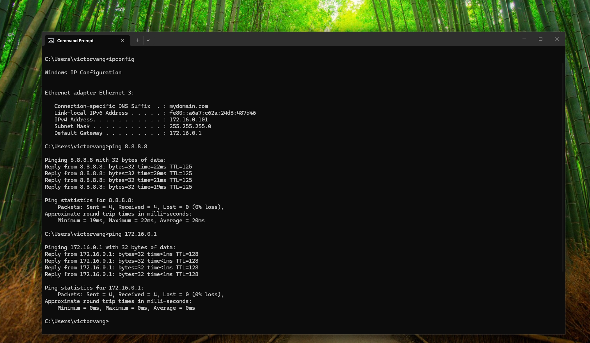

# Networking Fundamentals

## Objective
The purpose of this lab is to practice core networking concepts using VirtualBox, including how different virtual network adapter modes affect connectivity, and to build hands-on troubleshooting experience with common networking commands used in help desk and systems administration roles.

## Environment
- VirtualBox
- Windows 11 (Client 1)
- Windows Server 2022 (Domain Controller)

## Steps

### 1. Tested NAT Mode
- Set Client 1 Adapter 1 to **NAT**
- Booted the VM and opened CMD
- Ran `ipconfig` and confirmed an internal NAT IP (10.0.2.15)
- Ran `ping 8.8.8.8` and `ping google.com` to confirm internet connectivity
- Both pings succeeded with 0% packet loss

*Adapter 1 set to NAT — VM can access the internet through the host machine but is isolated from the local network*

*NAT mode confirmed working — IPv4 address 10.0.2.15 assigned by VirtualBox, successful ping to 8.8.8.8 and google.com with 0% packet loss*

### 2. Tested Bridged Mode
- Changed Client 1 Adapter 1 to **Bridged Adapter**, attached to the host's physical network adapter
- Booted the VM and ran `ipconfig` — confirmed the VM received an IP on the actual home network instead of the NAT range
- Ran `ping 8.8.8.8` to confirm internet access
- Attempted to ping the host machine's IP address from the client VM

*Adapter 1 set to Bridged — VM connects directly through the host's physical network adapter and receives an IP on the real home network*

*Bridged mode confirmed working — IPv4 address from Host Machine, successful ping to 8.8.8.8 and host machine with 0% packet loss*

### 3. Tested Internal Network Mode
- Changed Client 1 Adapter 1 from Host-Only to **Internal Network** to match the Domain Controller's internal adapter
- Verified both the client and the DC were using the same Internal Network name
- Ran `ipconfig` on the DC to retrieve its Internal Network IP
- Pinged the DC from the client VM and confirmed successful connectivity

*Client Adapter 1 set to Internal Network*

*Client VM successfully pinging the Domain Controller over Internal Network*

### 4. Practiced Core Commands
*(In progress — to be added)*

### 5. Simulated Troubleshooting Scenario
*(In progress — to be added)*

## Issues & Troubleshooting

- **Ping to host machine timing out in Bridged mode** — Windows Defender Firewall on the host blocks incoming ICMP echo requests by default. Fix: enabled the "File and Printer Sharing (ICMPv4-In)" inbound rule in Windows Defender Firewall Advanced Settings

- **Client VM unable to ping Domain Controller** — caused by a network mode mismatch. The client VM was set to Host-Only Adapter while the Domain Controller's internal adapter was set to Internal Network. These are two different VirtualBox modes and cannot communicate with each other even though both sound "internal." Fix: changed the client VM to Internal Network and confirmed both VMs were using the same network name, which resolved the connectivity issue

## What I Learned

- NAT mode routes a VM's traffic through the host machine using a private internal IP (10.0.2.x range) — the VM can reach the internet but is isolated from other devices, similar to how a company router performs NAT translation between internal private IPs and a single public IP

- Bridged mode connects a VM directly to the physical network, giving it an IP on the same network as the host machine — useful for simulating a device that behaves like a real physical machine on the network

- Host-Only Adapter and Internal Network are both "private" modes but are not interchangeable — Host-Only allows the host machine to communicate with VMs, while Internal Network isolates VMs from the host entirely and only allows VM-to-VM communication

- A VM can have multiple network adapters active at once for different purposes — for example, one adapter for internet access and a separate adapter for isolated internal network communication

- The Adapter Type shown in VirtualBox network settings (e.g. Intel PRO/1000 MT Desktop) represents emulated virtual hardware and stays consistent across modes — what changes is how that virtual adapter connects to the network, not the adapter itself

- Diagnosing a connectivity failure between two VMs requires checking the actual "Attached to" mode for each adapter rather than relying on adapter names, since adapters can be renamed in ways that don't reflect their actual configuration
