# osTicket Help Desk Ticketing System

## Objective
The purpose of this lab is to install and configure osTicket, an open source help desk ticketing system, and simulate a realistic IT help desk workflow. This includes setting up departments, agents, help topics, and SLA plans, then walking through the full ticket lifecycle from user submission to agent resolution across three different ticket types.

## Environment
- VirtualBox
- Ubuntu Server 22.04 (osTicket host)
- Windows 11 (host machine browser access)
- osTicket v1.18.4
- Apache, MariaDB, PHP (LAMP stack)

## Steps

### 1. Configured Departments

Departments represent the different teams within the IT organization. Every ticket lands in a default department first and gets routed from there during triage. All tickets land in Help Desk first regardless of issue type — the Help Desk agent triages and routes to the appropriate specialized department if needed.

- Removed default placeholder departments (Maintenance, Sales, Support)
- Created three departments reflecting a real IT organizational structure
- Set Help Desk as the default department so all incoming tickets route there first

| Department | Purpose |
|---|---|
| Help Desk (Default) | First point of contact for all incoming tickets |
| IT Support | Handles software, hardware, and general IT requests |
| Network Operations | Handles connectivity and network infrastructure issues |

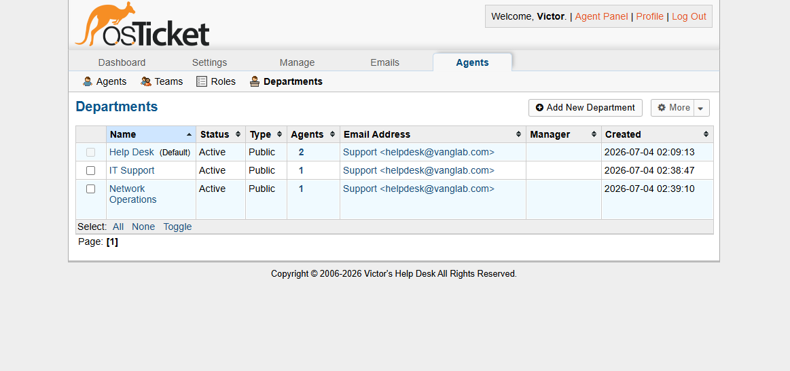

*Three departments configured with Help Desk set as default*

---

### 2. Created Agents

Agents are the IT staff members who receive and work tickets. Each agent belongs to a primary department. The admin account handles system configuration and triage — agents handle ticket resolution. This separation mirrors how a real help desk operates.

- Created three agents each assigned to a different department
- Each agent has full access permissions for this lab environment

| Agent | Username | Department |
|---|---|---|
| John Smith | jsmith | Help Desk |
| Jane Doe | jdoe | Network Operations |
| Ada Lovelace | alovelace | IT Support |

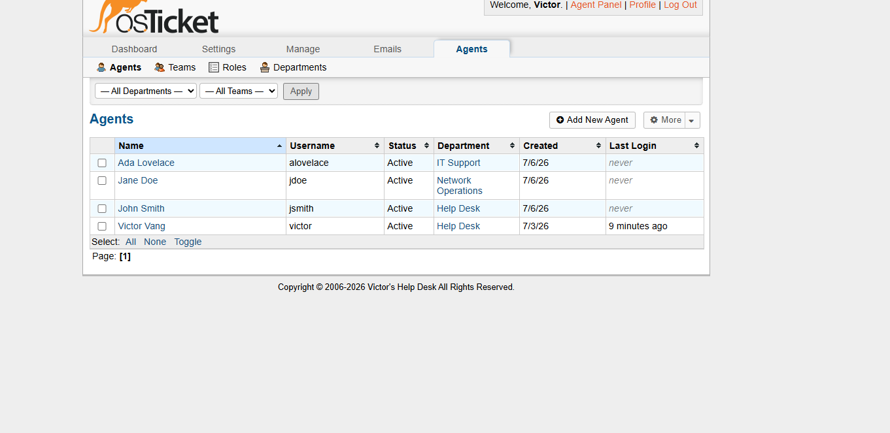

*Three agents created and assigned to their respective departments*

---

### 3. Created Help Topics

Help Topics are the categories users select when submitting a ticket. They help users describe their issue quickly and help the help desk automatically route tickets before an agent reviews them. All four topics default to Help Desk so tickets land there first for triage before being routed to specialized departments.

- Removed default placeholder help topics
- Created four help topics covering the most common IT help desk request types
- All topics set to Public so they appear on the user facing portal
- All topics default to Help Desk department for initial triage

| Help Topic | What it covers |
|---|---|
| Account Access Issues | Password resets, account lockouts, permission problems |
| Hardware Issue | Physical equipment problems requiring in-person visits |
| Network Connectivity | Internet and network access issues |
| Software Installation | Software install and update requests |

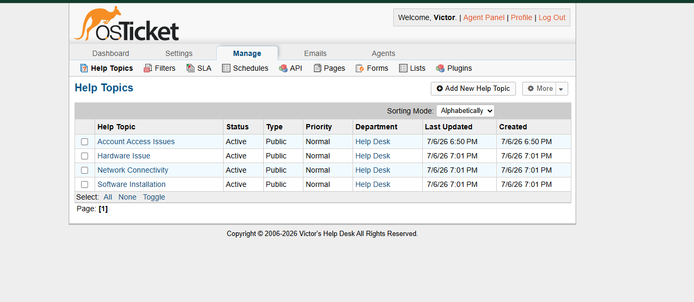

*Four help topics created, all set to Active, Public, and defaulting to Help Desk*

---

### 4. Created SLA Plans

SLA stands for Service Level Agreement — a commitment about how quickly IT will respond to and resolve different issue types. SLAs set expectations for users and give managers a way to measure team performance. Three severity tiers were created reflecting real world priority levels.

| SLA | Grace Period | Schedule | Used for |
|---|---|---|---|
| SEV-A | 1 hour | 24/7 | Critical — user completely unable to work |
| SEV-B | 4 hours | Business Hours | Moderate — user impacted but can still work |
| SEV-C | 8 hours | Business Hours | Low — routine requests, no immediate impact |

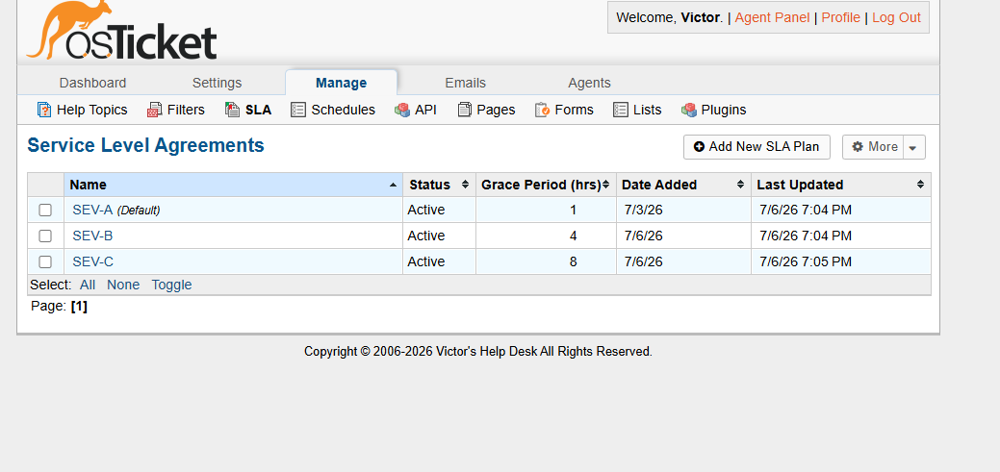

*Three SLA plans configured with grace periods and schedules*

---

### 5. Submitted Ticket 1 — Account Access Issue

Switched to the end user perspective using an incognito browser window to simulate a user submitting a ticket through the self service portal. An account lockout was chosen as the first ticket because it is the single most common help desk ticket type in any organization and maps directly to the Active Directory lab where account management was practiced.

> **Note:** In a production environment with a configured mail server, users would receive an email confirmation containing their ticket number. In this lab no mail server is configured so the confirmation page shows the ticket was created successfully without displaying a ticket number. Ticket numbers are visible in the agent panel queue. This is a known lab limitation.

- User: Bob Johnson
- Email: bob.johnson@example.com
- Help Topic: Account Access Issues
- Issue: Locked out of domain account, cannot log into workstation, has a meeting in one hour

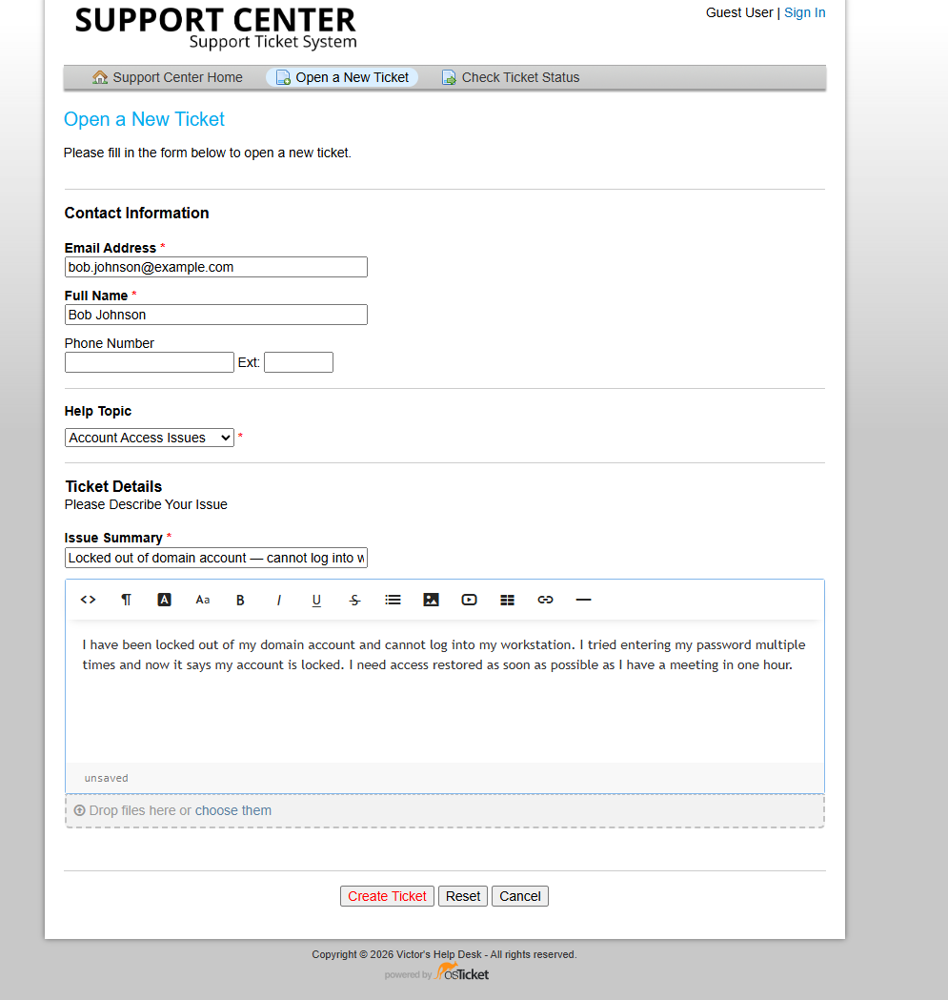

*Ticket 1 submission form filled out from the user portal*

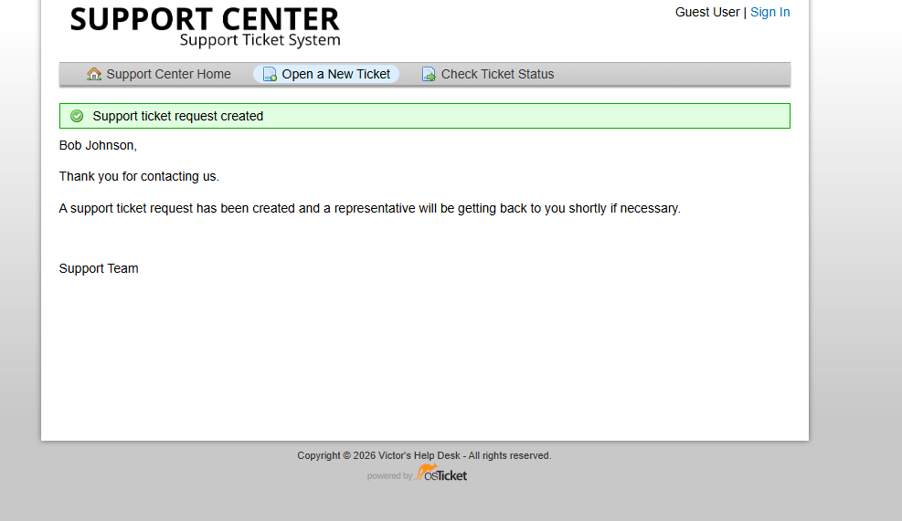

*Ticket 1 confirmation — support ticket request successfully created*

---

### 6. Submitted Ticket 2 — Network Connectivity Issue

- User: Sarah Williams
- Email: sarah.williams@example.com
- Help Topic: Network Connectivity
- Issue: No internet access after moving to a new desk, limited connectivity warning showing

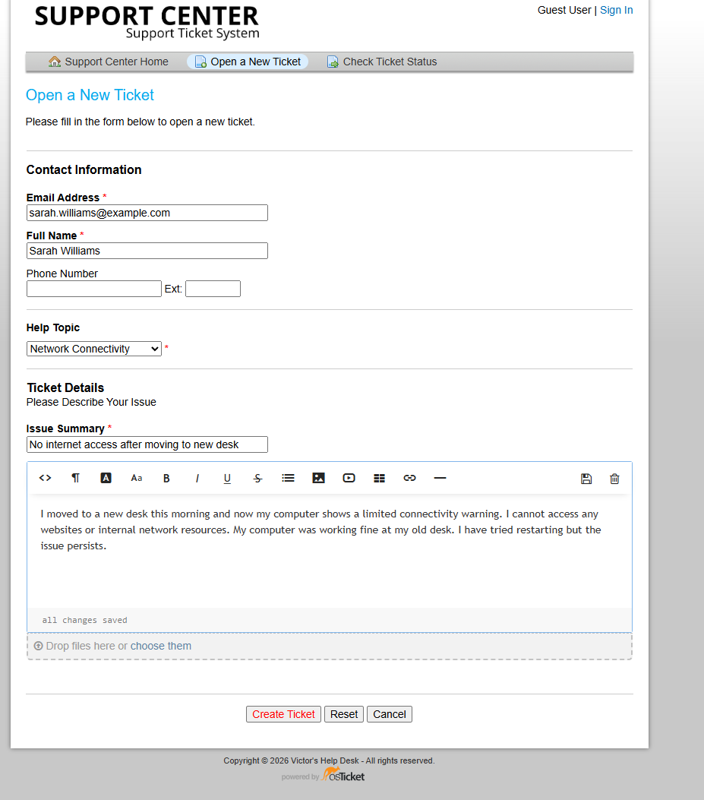

*Ticket 2 submission form filled out from the user portal*

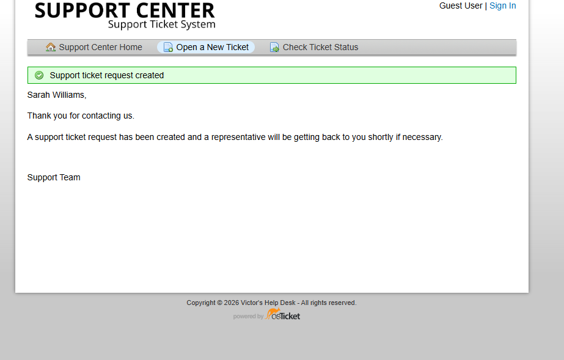

*Ticket 2 confirmation — support ticket request successfully created*

---

### 7. Submitted Ticket 3 — Software Installation Request

- User: Mike Davis
- Email: mike.davis@example.com
- Help Topic: Software Installation
- Issue: New employee, Microsoft Office not installed on laptop, manager confirmed valid license

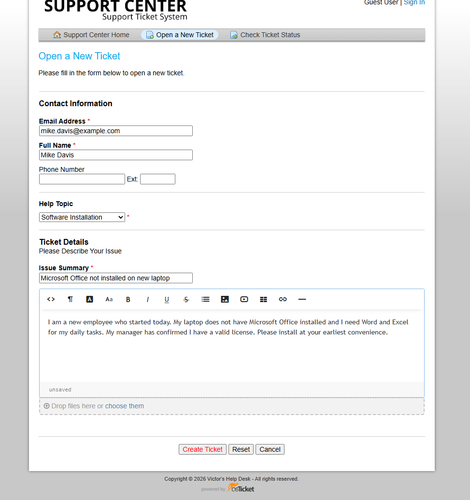

*Ticket 3 submission form filled out from the user portal*

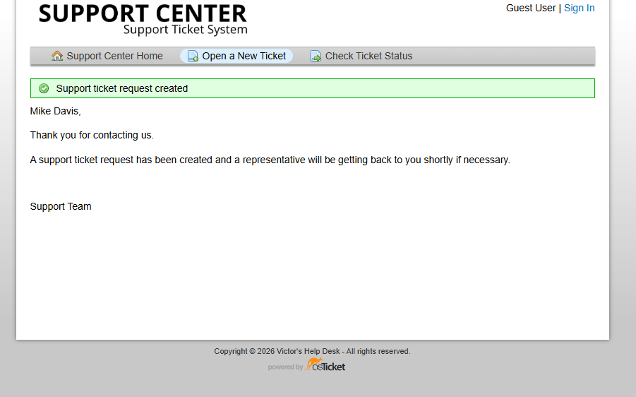

*Ticket 3 confirmation — support ticket request successfully created*

---

### 8. Viewed the Open Ticket Queue

Switched back to the admin account to begin triage. All three tickets arrived unassigned in the Help Desk queue, which is the expected behavior based on the default department configured in the help topics. This is the starting point for the triage process.

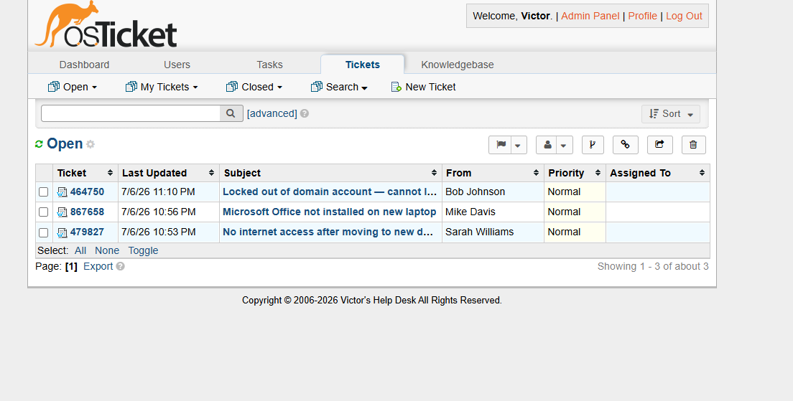

*All three tickets sitting unassigned in the open queue, ready for triage*

---

### 9. Triaged and Assigned All Three Tickets as Admin

The admin account acts as the dispatcher — reviewing each ticket, assessing severity, setting the SLA and priority, and routing each one to the correct department and agent. This triage process is what separates a well run help desk from a chaotic one. Each ticket was evaluated based on how severely the user was impacted.

**Ticket 1 — Account Access Issue → John Smith**
- The user is completely locked out and cannot work — highest severity
- Assigned To: John Smith
- SLA: SEV-A (1 hour, 24/7) — user is completely blocked
- Priority: High
- Department: Help Desk — account issues stay in Help Desk

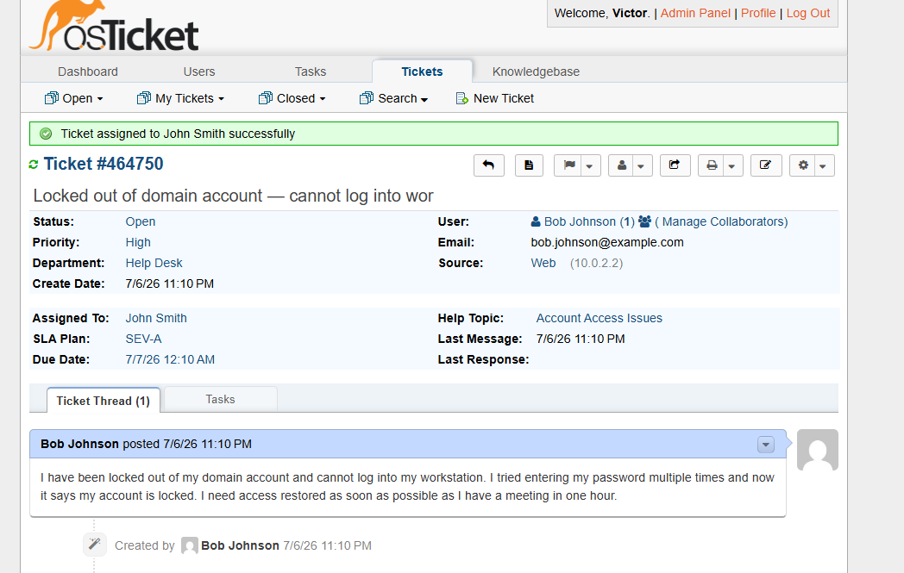

*Ticket 1 triaged and assigned to John Smith with SEV-A SLA*

**Ticket 2 — Network Connectivity → Jane Doe**
- The user has no network access at all — also highest severity
- Assigned To: Jane Doe
- SLA: SEV-A (1 hour, 24/7) — user has zero connectivity
- Priority: High
- Department: Network Operations — escalated out of Help Desk to the appropriate team

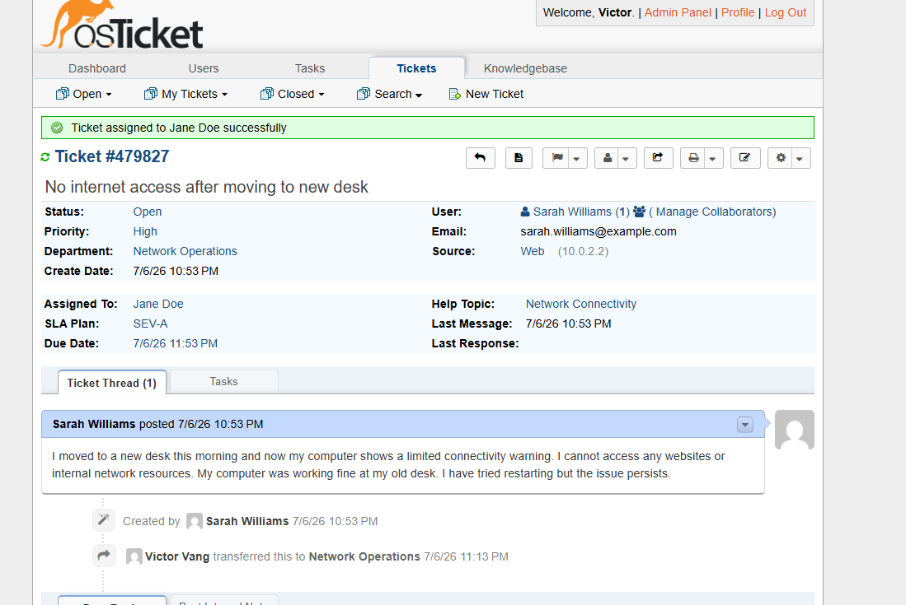

*Ticket 2 triaged and routed to Jane Doe in Network Operations with SEV-A SLA*

**Ticket 3 — Software Installation → Ada Lovelace**
- The user can still work — lowest severity of the three
- Assigned To: Ada Lovelace
- SLA: SEV-C (8 hours, business hours) — routine request, no immediate impact
- Priority: Normal
- Department: IT Support — software installs go to IT Support

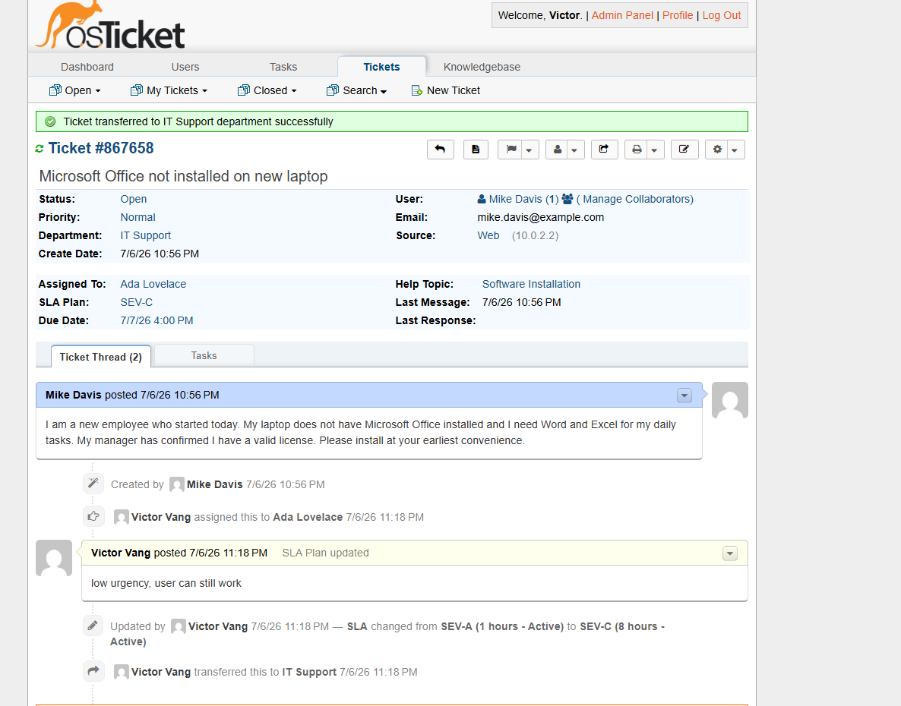

*Ticket 3 triaged and assigned to Ada Lovelace in IT Support with SEV-C SLA*

---

### 10. Resolved Ticket 1 as John Smith

Logged out of admin and logged in as John Smith to resolve the ticket from the agent's perspective. Internal notes are used instead of replies because they are only visible to agents — the user never sees them. Internal notes document what was done to resolve the issue, creating a record agents can reference if the same issue recurs.

The resolution note references unlocking the account and resetting the password in Active Directory — the same tasks practiced in the Active Directory lab.

- Logged in as: jsmith
- Ticket: Bob Johnson — Locked out of domain account
- Internal Note Title: Account Unlock — Resolved
- Resolution: Verified account lockout in Active Directory Users and Computers, unlocked the account, reset the password per company policy, confirmed user can log in successfully
- Status: Resolved

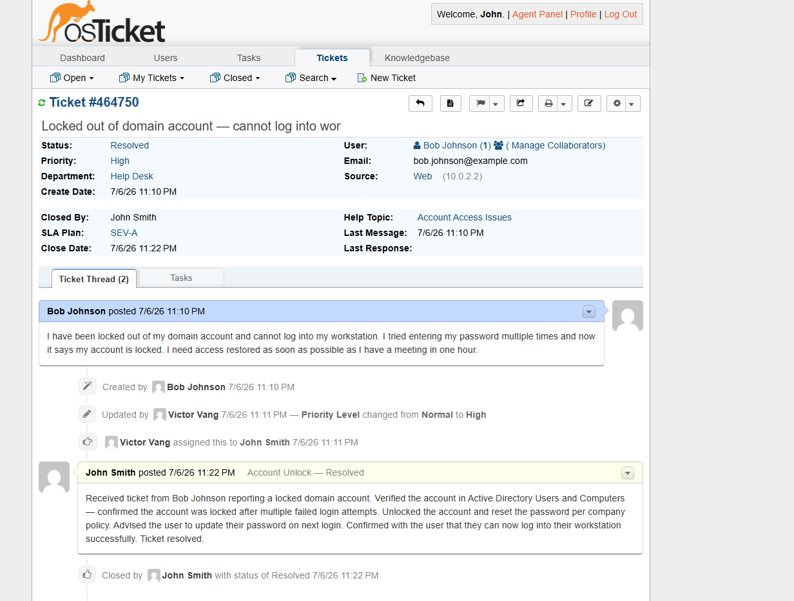

*Ticket 1 resolved by John Smith with internal note documenting the AD account unlock*

---

### 11. Resolved Ticket 2 as Jane Doe

Logged out of John Smith and logged in as Jane Doe to resolve the network connectivity ticket. The resolution note references the troubleshooting commands practiced in the Networking Fundamentals lab — running ipconfig to identify the 169.254.x.x self assigned IP, identifying the unplugged ethernet cable, and running ipconfig /release and /renew to restore connectivity. This step directly connects the Networking lab to this Ticketing lab.

- Logged in as: jdoe
- Ticket: Sarah Williams — No internet access after moving to new desk
- Internal Note Title: Connectivity Restored — Ethernet Cable
- Resolution: Ran ipconfig and confirmed 169.254.x.x self assigned IP indicating DHCP failure, identified unplugged ethernet cable at new desk, reconnected cable, ran ipconfig /release and /renew, confirmed valid IP assigned and connectivity restored
- Status: Resolved

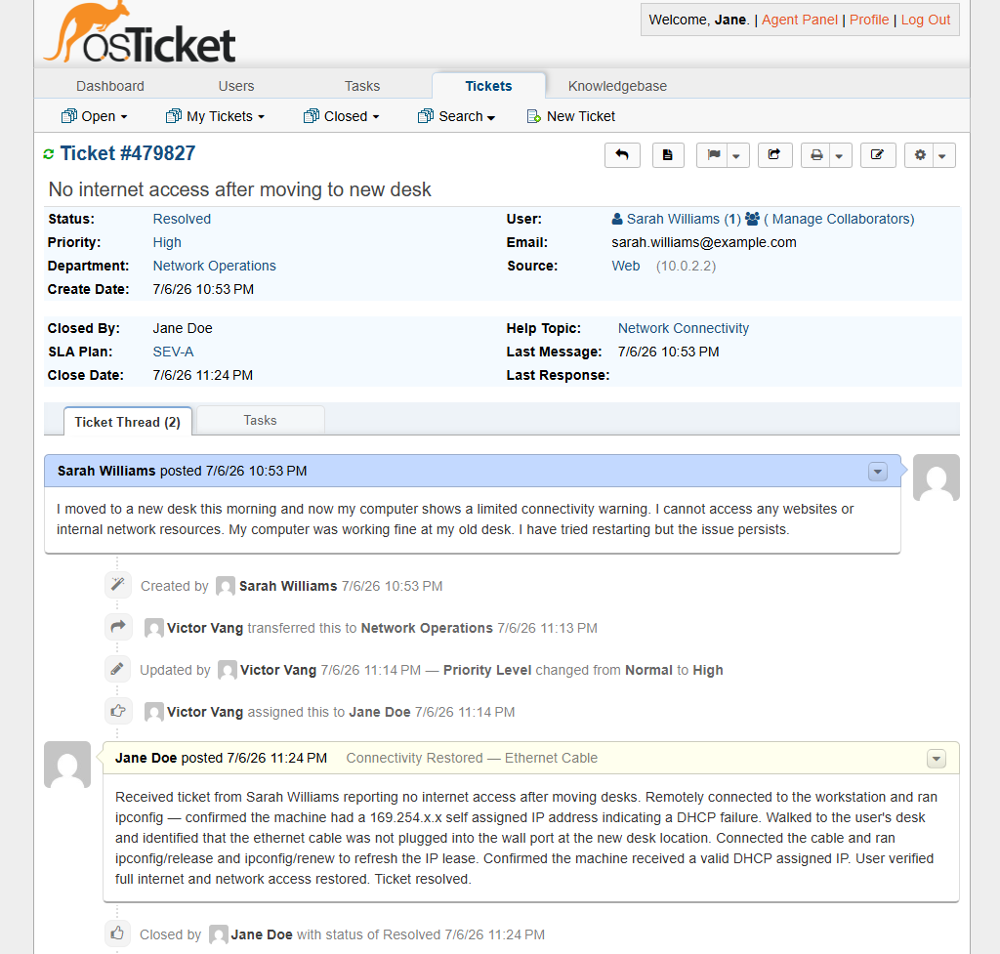

*Ticket 2 resolved by Jane Doe with internal note referencing network troubleshooting steps*

---

### 12. Resolved Ticket 3 as Ada Lovelace

Logged out of Jane Doe and logged in as Ada Lovelace to resolve the software installation ticket. License verification was included in the resolution note because installing unlicensed software exposes the company to legal risk — confirming a valid license exists before proceeding is standard practice in most IT departments.

- Logged in as: alovelace
- Ticket: Mike Davis — Microsoft Office not installed on new laptop
- Internal Note Title: Microsoft Office 365 Installed
- Resolution: Verified valid Office 365 license in admin portal, remotely installed Microsoft Office 365, confirmed Word and Excel opening correctly, advised user to restart to complete setup
- Status: Resolved

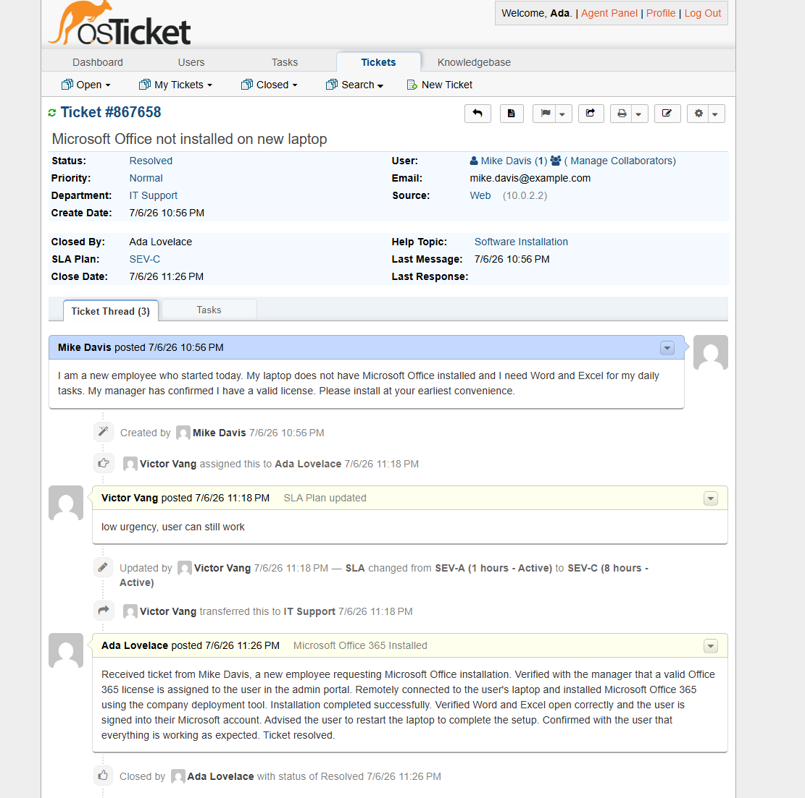

*Ticket 3 resolved by Ada Lovelace with internal note including license verification*

---

### 13. Viewed the Closed Ticket Queue

Logged back in as admin to view the final closed ticket queue showing all three tickets successfully resolved. This view represents the complete lifecycle of three different ticket types — from user submission through triage, assignment, and resolution by three different agents across three different departments.

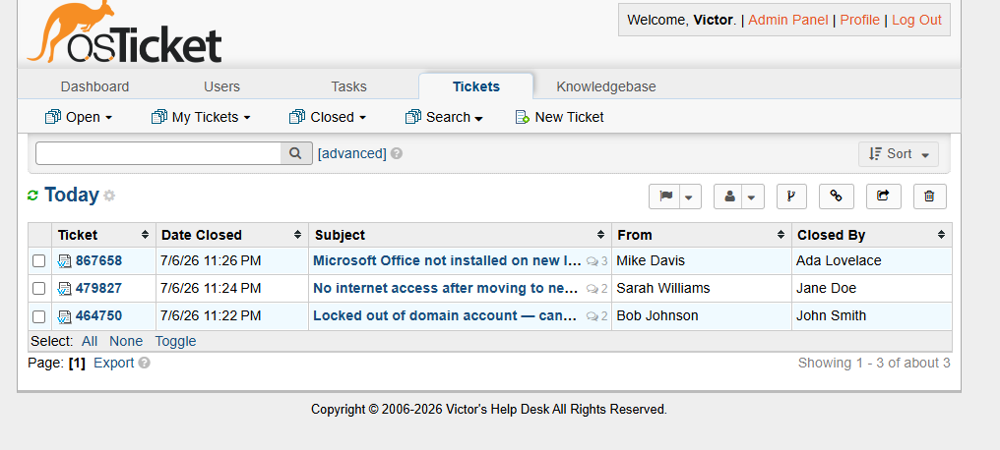

*All three tickets resolved and closed — full ticket lifecycle completed*

---

## Issues & Troubleshooting

- **Mailer error when submitting tickets** — osTicket was trying to verify email address domains and send confirmation emails without a configured mail server. Fixed by unchecking "Verify email address domain" in Admin Panel → Emails → Settings and installing nullmailer on the Ubuntu VM to silently handle PHP mail requests without actually sending anything

- **Ticket number not displaying on confirmation page** — in a production environment with a configured mail server, users receive an email confirmation containing their ticket number. Since no mail server is configured in this lab environment the confirmation page shows the ticket was created successfully but without a ticket number. Ticket numbers are visible in the agent panel queue. This is a known lab limitation that does not affect the core ticketing workflow

## What I Learned

- A ticketing system is the central tool of any help desk operation — every interaction with a user should be documented in a ticket so there is a record of what was reported, what was done, and when it was resolved

- Departments, agents, help topics, and SLA plans all work together to create a structured workflow — without these configurations tickets would arrive with no context, no priority, and no clear owner

- SLA plans reflect the real business impact of an issue — a user who is completely unable to work gets a 1 hour 24/7 SLA while a routine software install gets 8 hours during business hours because the business impact is fundamentally different

- Triage is one of the most important help desk skills — reading a ticket, assessing severity, and routing it to the right person quickly is what separates an effective help desk from a slow one

- Internal notes are how agents document their work — they are only visible to other agents and serve as a permanent record of how an issue was resolved, which protects the IT department and helps future agents handle similar issues faster

- The ticket lifecycle has distinct stages — submission, triage, assignment, investigation, resolution, and closure — and each stage has a specific purpose in the workflow

- Routing tickets to the correct department matters — a network issue handled by a Help Desk agent who doesn't know networking wastes time and frustrates the user, while routing it to Network Operations gets it to someone with the right skills immediately

- License verification before software installation is standard practice — installing unlicensed software exposes the company to legal risk so confirming a valid license exists before proceeding is a non-negotiable step

- The closed ticket queue is a record of team performance — managers use it to track resolution times, identify recurring issues, measure SLA compliance, and evaluate agent workload

- The osTicket workflow mirrors real enterprise ticketing tools like ServiceNow, Zendesk, and Jira Service Management — the concepts of ticket creation, assignment, SLA management, internal notes, and resolution are consistent across all these platforms
